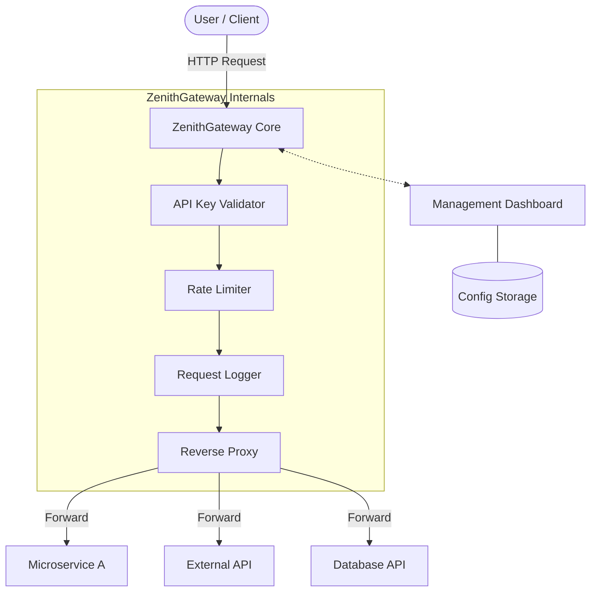

# 🌌 ZenithGateway

ZenithGateway is a lightweight, high-performance, and professional API Gateway / Reverse Proxy designed for developers who need a robust solution for routing, security, and monitoring.

Built with **Node.js**, **Express**, and **Vanilla JS**, ZenithGateway provides a seamless experience for managing your microservices and APIs through a stunning glassmorphic dashboard.

## ✨ Features

- 🚦 **Intelligent Routing**: Map incoming paths to internal or external services with ease.
- 🛡️ **API Key Management**: Generate, revoke, and monitor API keys for secure access.
- 📉 **Rate Limiting**: Protect your services from abuse with granular rate limiting.
- 📜 **Request Logging**: Capture detailed logs for every request, including latency and status codes.
- 📊 **Pro Dashboard**: A modern, premium UI for real-time monitoring and configuration.
- ⚖️ **GPL v3 Licensed**: Open source and free to use under the GPL v3 license.

## 🏗️ Architecture



## 🚀 Quick Start

### Prerequisites
- Node.js (v18+)
- npm

### Installation

1. **Clone the repository**:
   ```bash
   git clone https://github.com/kursat-dev/ZenithGateway.git
   cd ZenithGateway
   ```

2. **Install Dependencies**:
   ```bash
   # Install server dependencies
   cd server && npm install
   
   # Install client dependencies
   cd ../client && npm install
   ```

3. **Run the Application**:
   ```bash
   # Start the Gateway Server
   cd server && npm start
   
   # Start the Dashboard Client
   cd ../client && npm run dev
   ```

## 🛠️ Configuration

The gateway can be configured via the Dashboard UI or by modifying the `config.json` file in the `server` directory.

## 📄 License

This project is licensed under the **GPL v3 License**. See the [LICENSE](LICENSE) file for details.

---

Developed with Kursat_Dev
